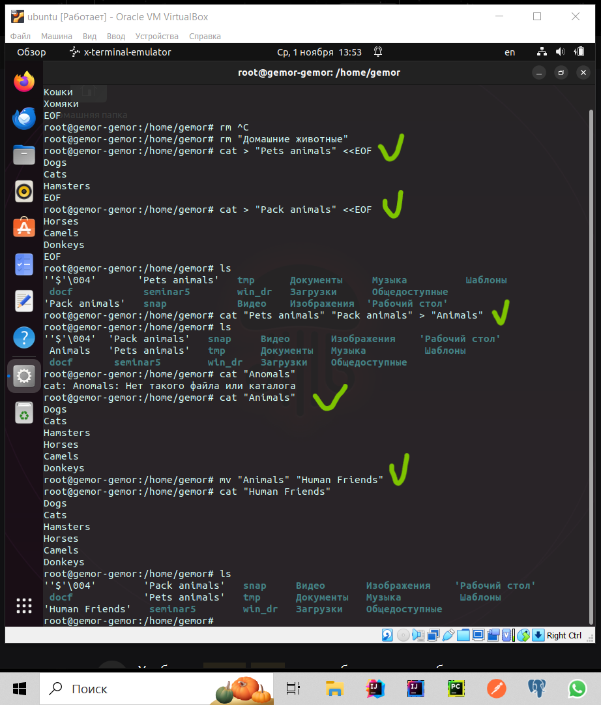

### Задание 1

cat > "Pets animals" <<EOF
Dogs
Cats
Hamsters
EOF

cat > "Pack animals" <<EOF
Horses
Camels
Donkeys
EOF

cat "Pets animals" "Pack animals" > "Animals"

cat "Animals"

mv "Animals" "Human Friends"

cat "Human Friends"

### Задание 2

mkdir Animals

mv 'Human Friends' Animals/

cd 'Human Friends'

cat 'Human Friends'

cd Animals

cat 'Human Friends'

### Задание 3

sudo wget https://dev.mysql.com/get/mysql-apt-config_0.8.23-1_all.deb

sudo dpkg -i mysql-apt-config_0.8.23-1_all.deb

sudo apt-get update

sudo apt-get install mysql-server

### Задание 4

sudo apt update

sudo install nginx

sudo stop nginx

sudo apt remove --purge nginx

### Задание 5

* *Все команды ubuntu выложены выше*.

### Заданиe 6

### Заданиe 7

*Бузу данных создал под названием animals_db, так как “Друзья человека”(Human Friends) уже ранее был создан в репозиторий в линуксе и будет называться так основной класс в написанной програме как указано на диаграме, чтобы в будущем не вызывать ошибку!*

### Заданиe 8

